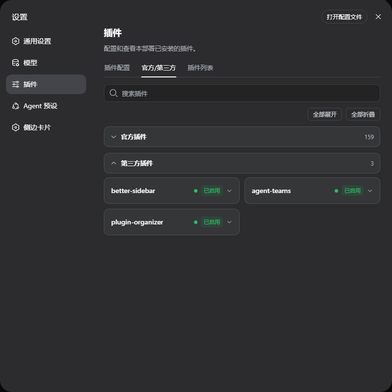

# dsh-plugin-organizer

A DSH web plugin that turns the plugin inventory in **Settings → Plugins** into an **Official / Third-party grouped view**, where each group can be **expanded / collapsed** (like a storage box). Official plugins are collapsed by default (there are simply too many of them), third-party plugins start expanded.

<div align="center">
  🌏 <a href="./README.md"><b>中文</b></a> · <a href="./README_EN.md">English</a>
</div>

<div align="center">
  <code>Official / 3rd-party</code> <code>Expand / collapse</code> <code>Search</code> <code>Status dots</code><br />
  Client-only plugin · no DSH source changes · one-command install via the official CLI
</div>

<!--
## Screenshots


-->

<div align="center">
  
</div>

## ✨ Features

- Adds a new **Official / 3rd-party** tab to the **Settings → Plugins** section (ordered between "Plugin configuration" and "Plugin list")
- Same data source as the official plugin list (`pluginInventory` Remote) — display only, no behavior changes
- **Official** detection: module names starting with `@deepseek-ai/` or `cordis:` (root include and other framework built-ins)
- Two groups: **Official plugins** collapsed by default, **Third-party plugins** expanded by default
- Group headers show the group name + plugin count; click a header to expand / collapse
- **Expand all / Collapse all** toolbar buttons
- Search box filters across both groups; searching auto-expands both groups
- Per-plugin cards identical to the official list: title, status dot, enabled/disabled tag; click a card to reveal entryId / configuration / Cordis status

## 🚀 Install (from GitHub / npm)

**Prerequisites**: DSH installed (`dsh web` runs), Node.js ≥ 20, pnpm ≥ 10.

```sh
# Install from the GitHub repository (auto-mounts, no manual config edits)
dsh plugin --profile web add Inspireason/dsh-plugin-organizer

# Or install from npm
dsh plugin --profile web add dsh-plugin-organizer
```

After installing, **restart DSH and hard-refresh** (Cmd/Ctrl+Shift+R) to see the new **Official / 3rd-party** tab.

> Note: the package declares `dsh.bundle.patch` (`cordis.patch.yml`), so `dsh plugin add` registers it into
> `dsh.profile.bundles` automatically. If your profile previously mounted this plugin manually (a row with
> `id: plugin-organizer` in its `cordis.patch.yml`), remove that row first to avoid double-mounting
> (two plugin tabs).

## 📁 Project structure

```
dsh-plugin-organizer/
├── package.json          # dsh.bundle.patch + dsh.client declarations
├── cordis.patch.yml      # bundle mount layer (inserts the plugin row)
├── lib/
│   ├── index.js          # host half (empty apply)
│   ├── invariant.js      # invariant companion
│   └── client.js         # browser half: the grouped inventory tab
└── README.md / README_EN.md
```

## 🔧 How it works

- Client-only plugin: `lib/index.js` is an empty host half, `lib/client.js` is the browser half
- Registers a new tab into the `settings.plugins.tab` slot (id `grouped`, order 5)
- Reads the same data as the official list via `ctx.remote.pluginInventory.list()`
- Ships as an independent package referenced by the profile — DSH source is never modified

## 💻 Development

For local development, add the plugin as a dependency of the web profile and mount it in the profile's `cordis.patch.yml`:

```yaml
- insert:
    - id: plugin-organizer
      name: 'dsh-plugin-organizer'
```

The profile's user patch layer is hot-reloaded by a running DSH — edit `lib/client.js` and refresh the browser to see the change.

## License

MIT
